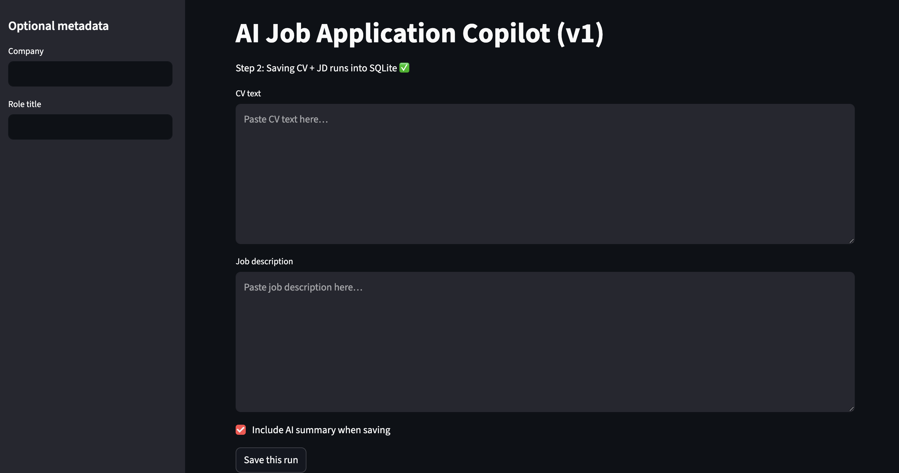

## Demo

# AI Job Application Copilot (v1)

A Streamlit app that lets you paste a CV and job description, save each run to SQLite, and attach an AI-style analysis (currently mocked). Built step-by-step to mirror real data product development: UI → data storage → analysis.

## Features
- Streamlit UI for CV + Job Description input
- Saves runs to a local SQLite database (`runs.db`)
- Mock "AI Analyse" button generates a structured summary
- View previously saved AI summaries by run_id

## Tech
- Python
- Streamlit
- SQLite (via Python `sqlite3`)
- (Future) OpenAI API for real LLM scoring + structured outputs

## Run locally
1. Create and activate a virtual environment
2. Install dependencies:
   pip install -r requirements.txt
3. Start the app:
   python -m streamlit run app.py

## Next steps (planned)
- Store structured fields: fit_score, required_skills, gaps
- Add outcomes tracking: Applied / Interview / Rejected
- Add charts: fit_score vs outcomes, recurring gaps, skill trends
- Swap mock AI with real API when quota/billing enabled

## What I learned
- How to structure a small data product end-to-end
- Using SQLite for lightweight persistence
- Designing AI features safely with mock outputs first
- Managing real Git merges and repository hygiene

